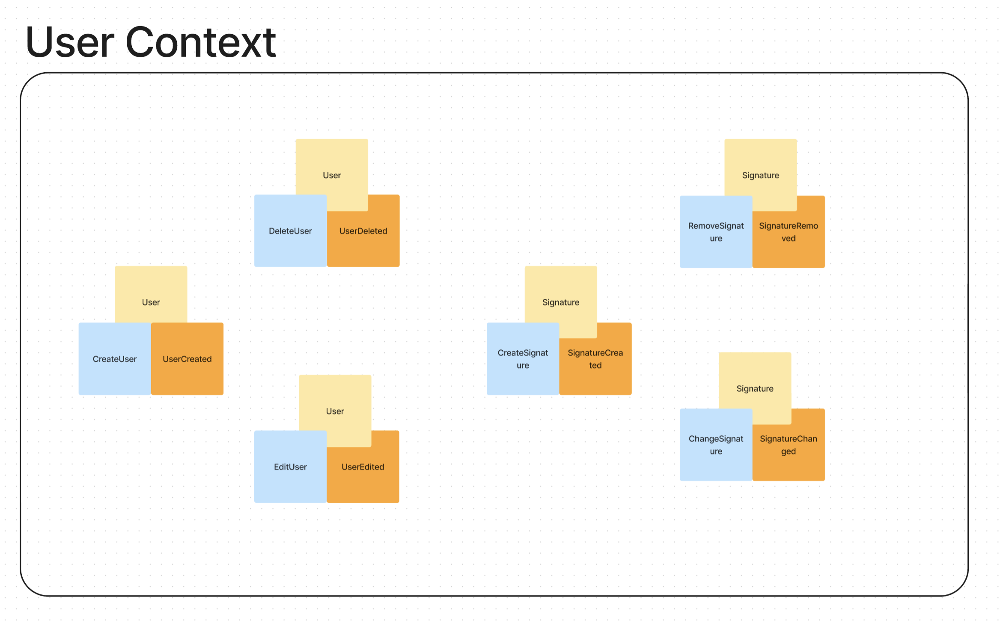
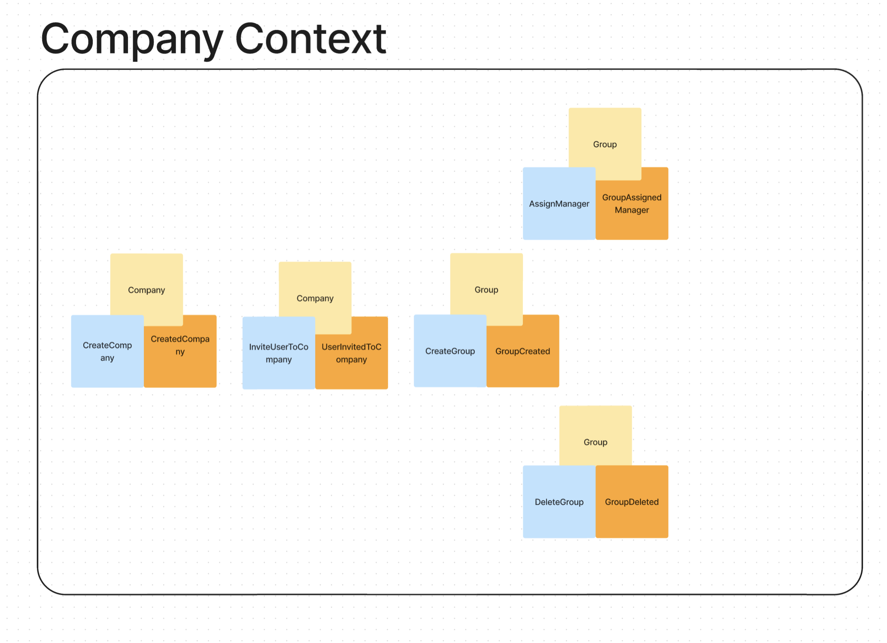
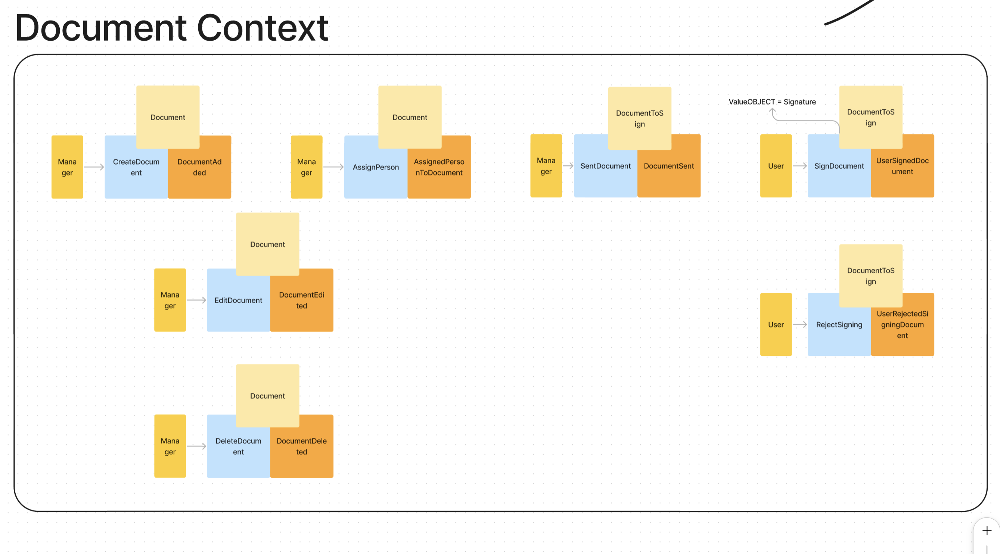

# [FIGMA FILE](https://www.figma.com/file/5MNSHACinh1ojYDw2KWtMr/524863---System-na-automatizovanou-vymenu-dokumentov-a-podpisovanie?type=whiteboard&node-id=140-741&t=ePViNycaEuAJJVbk-0)
# System na automatizovanou výmenu dokumentov a podpisovanie
+ isiel som na to z pohladu pre korporatne riesenie
+ velka firma ma viac pobociek kde mozu byt niaky managery ktory maju pod sebou ludi ktorym mozu davat elektoronicky podpisovat zmluvy, GDPR, NDA etc...
+ uzivatel si dokaze pridat zmenit a zmazat podpis rovnako aj s uctom
+ kazdy v systeme musi mat ucet a potom uz len zalezi na uzivatelsky pravach
+ manazer si vie pridat ku zmluve viac ludi a tym ju pridelit viacerym na podpisanie
+ uzivatelia (zamestnanci) vedia zmluvu podpisat / odmietnut

