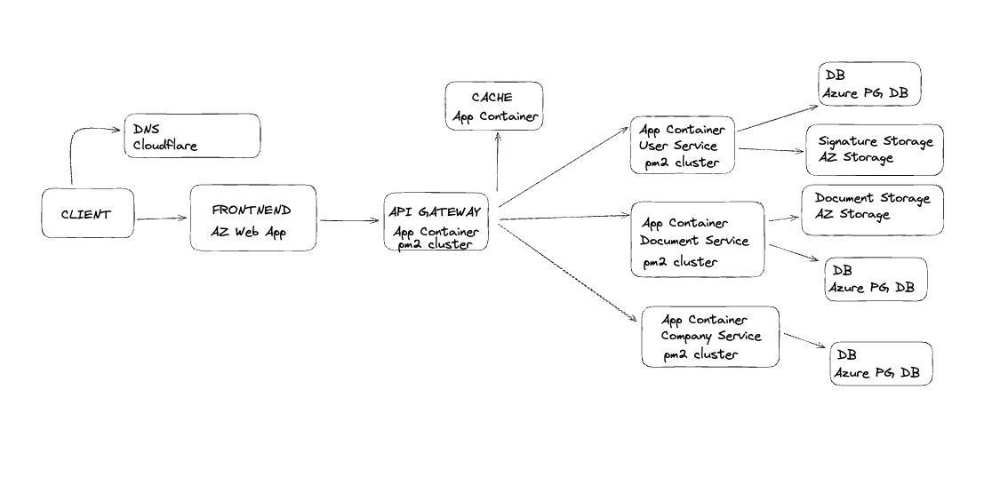
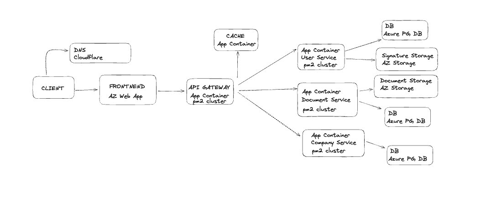
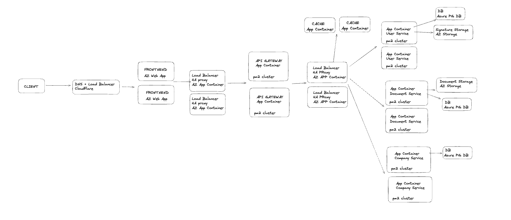

<a href="./pv293.excalidraw" download>Click here to download the EXCALIDRAW INFRASTRACTURE</a>

# Pre 1,000 UZIVATELOV

### Vysvetlenie
Realne pre nas by to bolo 10x spolocnost so 100 uzivatelmi alebo podobne pokial
su tie cisla takto male by som sa nebal vypadkov a neimplementoval zbytocne LA a podobne
jedine co je dolezite je ZACHOVANIE VSETKYCH DOKUMENTOV kedze su vo virtualnej podobe
Zacal by som DNS pomocou Cloudflare ktora ma niaky free tier co by nam stacil
V buducnosti by sa mi nechcelo scalovat masiny ked zacnu nabiehat uzivatelia tak pouzijeme
obycajnu AZ Web App ak sa da zmenime na Static aby to vyslo lacnejsie ak potrebujeme,
kazda nasu backend servicu pustime pomocou pm2/strongloop aby bezala v clustery teda viac instancii a restart on crash
potom pre 5 nase services ktore vytvorime samostatny docker image pouzijeme App Container
pre API Gateway Container pouzijeme viac vCPU aby dokazalo rychlejsie odbavovat requesty,
pre Redis Cache Container pouzijeme nieco s trocha viac memory aby sme do nej dokazali cachovat vysledky
vsetkych databaz co pri 1000 uzivateloch by malo vystacit 500mb s tym ze realne tam nebudeme mat viac ako 400mb
Dalej potrebujeme 3 samostatne DB, najjednoduchsie aby sme sa nemuseli starat o backup
a podobne... pouzijeme co nam Azure dava a teda Azure Database for PostgreSQL vsetky 3 DB nepotrebuju nic extra
zatial budu mat velmi malo dat takze si vystacime s najslabsimi hlavne nam tu ide o memory aby sme ju dostali celu do RAMky
Potom storage pre dokumenty a signatury znova samostatne aby kazda servica nepristupovala k cudzim veciam takze
samostatny Storage Account

### Cena
    DNS -> Cloudflare for free!

    AZ Web App -> Tier B1 0.018/h -> 24h -> 30days = 13$ 1CORES 1.75GB RAM

    5 x Service App -> vsetky budu mat 1vCPU a 1GB memory pricom Servicy budu mat 2GB
    orientacne to bude okolo vCPU = 0.00809 * 5 (kontajnerov) * 24 * 30 => 30$
    za 1-2GB RAM to bude 0.0067 * 1.5 * 5 (kontajnerov) * 24 * 30 => 36$

    3 x PG DB -> 1vCPU a 2GB memory takze 30$ * 3 = 90$

    2 x Storage -> < 10$

    TOTAL: 0[DNS] + 13 [WEB APP]+ (30+36) [SERVICES] + 90 [DBs] + 10$ [Storage] = 170

# Pre 10,000 UZIVATELOV

### Vysvetlenie
Ked si zoberiem scenare ze budeme mat 100firiem so 100uzivatelmi alebo 10 po 1000 stale mame peak velmi malo transakci
a podobne lebo realne asi nenastava kedy by vsetci z niakeho dovodu prisli do systemu. Takze zoberiem to maximum okolo 10,000
DNS zostavame u Cloudflaru a pridavame load balancer, nie je potreba migrovat. Ked uz mame viac uzivatelov vypadok webu alebo
migracia na novy a jej testovanie by pomohlo mat dalsi web appku live takze vytvorime dalsiu AZ Web App, kedze sa nejedna o 
ecomm alebo podobne systemy kde nastavaju narazove prichodi uzivatelov tak nase riesenie je pre stredne velke firmy az korporaty
nikdy nepojde zrazu cele oddelenie v 5minutach podpisovat zmluvu. Ak by trebalo tak sa len prida GATEWAY aby sa zabranilo Single point of failure
Samozrejme ze UPTIME je dolezity ale v pripade vypadku sa vacsinu casu nic nestane hlavne ide o zachovanie DAT za kazdu cenu! Toto je 
nieco co nas produkt MUSI GARANTOVAT! Od API Gateway by som nic extra nemenil 10x narast by v nasom systeme sposobili trocha narast concurent uzivatelov
ale maximalne sa tak zmeni traffic

### Cena
    DNS -> Cloudflare DNS 0 + 5$ for Load Balancer s 2 origin serverami + 0.5$ za 500k requestov
    ak mame 10,000 uzivatelov, kazdy zamestatnec pojde do systemu aspon raz za rok podpisat / predlzit zmluvu
    takze mame dajme tomu 10page/views na visit potom tam moze prist niake nove podmienky, GDPR a niekedy
    si mozno znova precitat zmluvu atd tak dajme ze priemerny zamestnanec pride do systemu 12 krat za rok
    takze spravi 10 page/views * 12 => 120nastev => takze za mesiac to vychadza niakych 10 page view / USER takze
    dostavame 10 * 10,000 => 100,000 a prvych 500k requestov je zadarmo takze platime len 5$

    AZ Web App -> Tier B1 0.018/h -> 24h -> 30days = 13$ 1CORES 1.75GB RAM * 2 STROJE = 26$
    
    5 x Service App -> vsetky budu mat 1vCPU a 1GB memory pricom Servicy budu mat 2GB
    orientacne to bude okolo vCPU = 0.00809 * 5 (kontajnerov) * 24 * 30 => 30$
    za 1-2GB RAM to bude 0.0067 * 2 * 5 (kontajnerov) * 24 * 30 => 48$
    
    3 x PG DB -> 1vCPU a 2GB memory takze 30$ * 3 = 90$
  
    
    Document STORAGE => assumption strop uzivatel ma maximalne okolo 30 dokuemntov => 300,000 a ked zoberieme ze kazdy z toho je 2MB
    tak mame 600GB takze COLD => $0.0045 * 600 => 3$
    ONE TIME => teraz WRITE na COLD storage $0.234 / 10k => 300k/10k * 0.234 => 7$ 
    MONTHLY READ => COLD => uzivatelia pridu do systemu 10krat za rok => pozru 4 dokumenty => 40 nastev / 12 => 3.5dokumentov otvorenych za mesiac
    takze $0.13 za 10k READ operaci tak dostavame 10,000 * 3.5 / 10k * 0.13 => 1$
    
    Sig STORAGE => assumption strop uzivatel mal za zivot 3 podpisy => 30,000 a ked zoberieme ze kazdy z toho je 1MB
    tak mame 30GB takze COLD => $0.0045 * 30 => < 1$
    ONE TIME => teraz WRITE na COLD storage $0.234 / 10k => 30k/10k * 0.234 => 1$ 
    MONTHLY READ => COLD => uzivatelia pridu do systemu a podpisuju asi len par papierov tkze vtedy zobrazujeme podpis => podpisuju realne nieco
    4krat rocne maximalne a to 4dokumenty takze 16 krat zobrazime podpis dajme tomu ze 2 zobrazenia podpisu na mesiac => 0.13$ * 10,000/10k * 2 => < 1$

    TOTAL: 5[DNS] + 26 [WEB APP]+ (30+48) [SERVICES] + 90 [DBs] + 4+2$ [Storage] ? = 205$

# Pre 1,000,000 UZIVATELOV

### Vysvetlenie
Pre 1,000,000 uzivatelov uz mame dost platiacich spolocnosti a UPTIME zacina byt dolezity
Nic extra sa nemeni oproti architekture pre 10,000 uzivatelov len zrazu pouzivame viac Load Balancerov a viac
instanci service aby v pripade vypadku jednej sme dokazali mat co najvyssi UPTIME, znova iba silnejsie masiny a to je vsetko,
databaze vyjdu celkom draho ale bal by som sa v pripade ze by bezali na nasom zeleze pripadu vypadku a straty suborov zalohy a podobne
takze for now OUTSOURCE

### Cena
    IMO OVERKILL?
    DNS -> Cloudflare DNS 0 + 5$ for Load Balancer s 2 origin serverami + 0.5$ za 500k requestov
    ak mame 1,000,000 uzivatelov, kazdy zamestatnec pojde do systemu aspon raz za rok podpisat / predlzit zmluvu
    takze mame dajme tomu 10page/views na visit potom tam moze prist niake nove podmienky, GDPR a niekedy
    precitat si zmluvu a podobne. Budeme pesimisisti a povieme ze navstevuju nas web 6krat za mesiac a urobia priemerne
    10 page views / visit takze za mesiac spravia 60 page views. Takze mame 60 * 1,000,000 => 60,000,000 
    takze to vychadza 5$ za load balancer a 60,000,000 / 0.5M requestov * 0.5$ => 120 * 0.5 => 60$

    AZ Web App -> Tier B3 $219/month * 2 => 440$
    
    Load Balancers => 4 x Az App Container => CPU intensive takze 2vCPU 4GB RAM => 1 CPU / month = 34$
    1 GM RAM / month ±= 4$ => jeden stroj bude 34*2 + 4*4 => 84$ * 4 => 336$

    CACHE x 2 => TREBA RAM a ta je zadarmo takze znova App Container => 1vCPU 16GB ram => 34 + 16*4 => 98 * 2 = 196$

    DB Azure => 3 x General purpose 2vCPU 10GB RAM => 152$ * 3 => 456$

    2 API GATEWAY APP CONTAINERs => znova viac CPU a niaku RAM => 4vCPU 8GB RAM = 34*4 + 8*4 => 152 * 2 => 304$

    6 AZ Containerov so Servicami => 2vCPU 4GB RAM => 2*34 + 4*4 => 80 * 6 => 480$
    
    Document STORAGE => assumption strop uzivatel ma maximalne okolo 30dokuemntov => 30,000,000 a ked zoberieme ze kazdy z toho je 2MB
    tak mame 60000GB takze COLD => $0.0045 * 60000 => 270$
    ONE TIME => teraz WRITE na COLD storage $0.234 / 10k => 30M/10k * 0.234 => 702$ 
    MONTHLY READ => COLD => uzivatelia pridu do systemu 10krat za rok => pozru 4 dokumenty => 40 nastev / 12 => 3.5dokumentov otvorenych za mesiac
    takze $0.13 za 10k READ operaci tak dostavame 1,000,000 * 3.5 / 10k * 0.13 => 45$
    
    Sig STORAGE => assumption strop uzivatel mal za zivot 3 podpisy => 3,000,000 a ked zoberieme ze kazdy z toho je 1MB
    tak mame 3000GB takze COLD => $0.0045 * 3000 => 14$
    ONE TIME => teraz WRITE na COLD storage $0.234 / 10k => 3M/10k * 0.234 => 70$ 
    MONTHLY READ => COLD => uzivatelia pridu do systemu a podpisuju asi len par papierov tkze vtedy zobrazujeme podpis => podpisuju realne nieco
    4krat rocne maximalne a to 4dokumenty takze 16 krat zobrazime podpis dajme tomu ze 2 zobrazenia podpisu na mesiac => 0.13$ * 1,000,000/10k * 2 => 26$
    

    TOTAL: DNS[60] + FE [440] + LB [336] + DB [456] + Containers [ 304 + 480 ] + Storages [270 + 45 + 14+ 26] = 2300$ + ONE TIME WRITE FEE 770$
